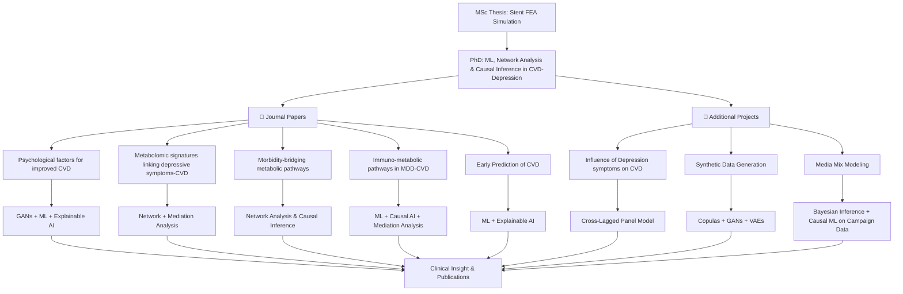

# Portfolio  
**Angela Koloi, PhD** 
🔗 [LinkedIn](https://www.linkedin.com/in/angela-koloi-b777381b9/)  

---

## 📌 Overview  
This repository contains my academic and research work in **computational medicine**, including:  
- **MSc Thesis** (Finite Element Analysis of Stent Deployment)  
- **PhD Research** (ML, metabolomics & causal discovery in CVD-depression comorbidity)  
- **Peer-reviewed publications** (UK Biobank, Lifelines, Young Finns Study & NESDA)  
- **Additional projects** (Cross-lagged models, ML prediction, Synthetic Data Generation, Media Mix Modeling)  

---
## 🔄 Computational Research Workflow



## 📂 Repository Structure  
- **Education**
  - `MSc_Medical_Engineering/` - ANSYS FEA simulations  
  - `PhD_Computational_Medicine/` - LaTeX thesis   
- **Publications & Codes**
  - `1_ML_Mental_CVD_Prediction/` - GANs + ML pipelines  (Lifelines & UK Biobank)
  - `2_Metabolomics_Depression_CVD/` - Network analysis (UK Biobank)
  - `3_Metabolic_Pathways/` - Network analysis + Causal Inference (YFS & UK Biobank)
  - `4_Causal_Discovery/` - DAG models & Mediation analysis (NESDA)
- **Additional Projects**
  - `Media_Mix_Modeling/` Developed marketing attribution models to quantify the impact of various media channels on customer conversion using Bayesian statistical approaches.
  - `Cross_Lagged_Models/` - Cross Lagged model Depression-CVD risk (YFS)
  - `LURIC_ML/` - ML Early CVD prediction (LURIC)
  - `Synthetic_Data_Generation/`
---

## 🚀 Quick Access  
| Project               | Links |
|-----------------------|-------|
| **MSc Thesis**        | [🎥 Simulation](https://drive.google.com/file/d/1AGg2njnA9Y3aTKpXHYSJBVBFx7lyc45J/view?usp=sharing) |
| **PhD Dissertation**  | [📜 LaTeX Source](https://www.overleaf.com/read/ydvwjzybzvsg#067f5f) |
| **Key Papers**        | [🔗 DOI 1](https://doi.org/10.1093/ehjopen/oeaf038) · [🔗 DOI 2](https://doi.org/10.1016/j.bpsgos.2025.100528) · [🔗 DOI 3](https://doi.org/10.1093/ehjdh/ztae049) · [🔗 DOI 4](https://doi.org/10.1109/EMBC40787.2023.10340194) |

---

## 🛠️ Setup & Usage  
### For Code Reproducibility  
1. Clone the repo:  
   ```bash
   git clone https://github.com/AngelaKoloi/Biomedical-Data-Science-Research.git
2. Install dependencies:
   ```bash
   pip install -r requirements.txt  # For Python-based projects
